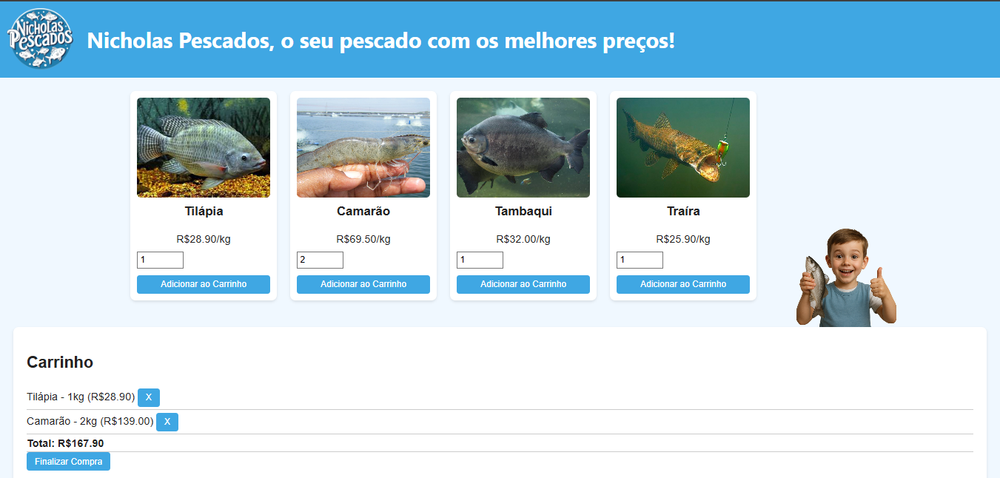

# Projeto Nicholas Pescados

O projeto **Nicholas Pescados** consiste em um sistema simples de venda de pescados online. O sistema permite que o usuário escolha diferentes tipos de peixe (Tilápia, Camarão, Tambaqui e Traíra), informe a quantidade em kg desejada, adicione ao carrinho e visualize o valor total da compra. O site também possibilita remover itens do carrinho e finalizar compra.  

Trata-se de uma aplicação **fullstack**, contendo:
- Back-end: Node.js + Express + PostgreSQL
- Front-end: HTML, CSS e JavaScript puro
- Banco de dados: PostgreSQL (tabelas `fishes` e `orders`)

## Design do Projeto

## Objetivo do site

O site tem como objetivo facilitar a compra de pescados de forma rápida e prática.  

No site, o usuário pode:
- Visualizar os pescados disponíveis com foto, nome e preço por kg
- Selecionar a quantidade desejada em kg usando um campo numérico com setas
- Adicionar diferentes tipos de peixe ao carrinho
- Visualizar os itens do carrinho e o valor total
- Remover itens individuais do carrinho
- Finalizar a compra
